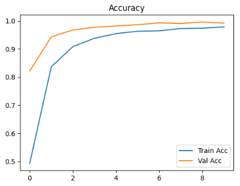
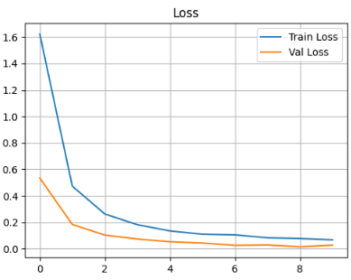
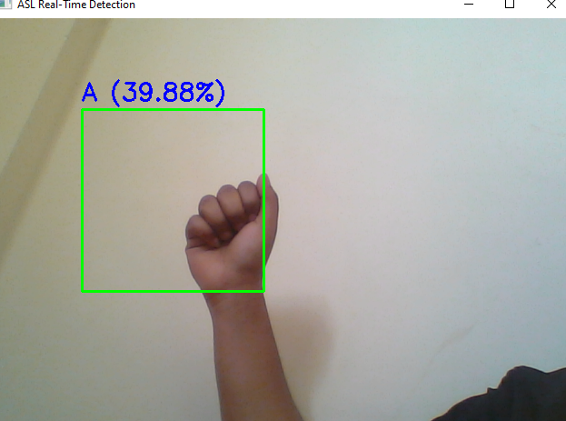
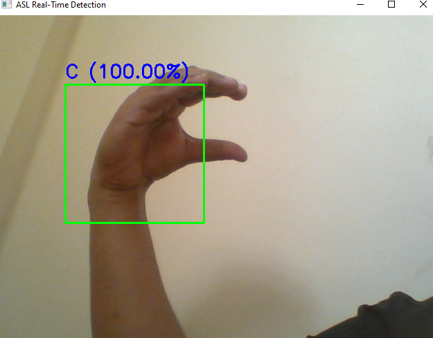
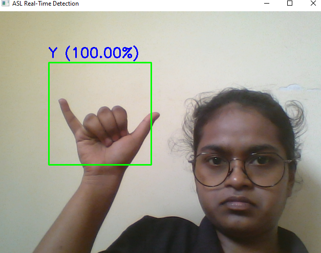

# 🎯 ASL Alphabet Recognition using CNN

This project builds a deep learning model to recognize American Sign Language (ASL) alphabets using grayscale image data. It utilizes a Convolutional Neural Network (CNN) trained on the [ASL Alphabet Dataset](https://www.kaggle.com/datasets/grassknoted/asl-alphabet) and achieves 99% accuracy. The model is integrated into a real-time webcam inference application.

---

## 📁 Dataset

- **Source**: [ASL Alphabet Dataset on Kaggle](https://www.kaggle.com/datasets/grassknoted/asl-alphabet)
- **Structure**: 87,000+ images, 29 classes (A-Z, SPACE, DELETE, NOTHING)

---

## 📌 Features

- **IMDB 50K Review Dataset**  
- **Custom Text Preprocessing** (Lowercasing, punctuation removal, stopword filtering)
- **Bidirectional LSTM Model** in Keras
- **Model Checkpointing + Early Stopping**
- **Tokenizer & Model Saved** for Inference
- **Real-time Prediction** script
- **Optional Streamlit Web Interface**

---

## 🗂️ Folder Structure

- **app.py**  
- **predict.py**
- **best_model_CNN.h5**
- **Real_Time_Obj_Detection_CNN.ipynb**
- **requirements.txt**
- **README.md**
  
---  

## ⚙️ How to Run

### 🔧 Step 1: Install Required Packages

```bash
pip install -r requirements.txt
 ``` 

### 📁 Step 2: Run CLI Prediction Script(Optional)

```bash
python predict.py
```

### 🌐 Step 3: Launch Web App

```bash
streamlit run app.py
```
---

## 📊 Model Architecture
``` bash
Conv2D(128) → MaxPool
Conv2D(64) → MaxPool
Conv2D(32) → MaxPool
Flatten → Dense(256) → Dropout
Dense(128) → Dropout → Dense(64)
→ Output Layer: 29 softmax classes

```
---

## 🔁 Training Info

- **input image size: 60x60 grayscale**
- **Split: 80% train / 20% validation**
- **Optimizer: Adam**
- **Loss: Categorical Crossentropy**
- **Callbacks: ModelCheckpoint, EarlyStopping**
- **Batch Size: 64**
- **Epochs: 10**

---

## 🧪 Sample Outputs

### 📈 Accuracy Graph


### 📉 Loss Graph


### 🖼️ ASL


### Screenshots

#### 🖼️ U


#### 🖼️ M


#### 🖼️ A


#### 🖼️ C


#### 🖼️ Y


---

#### ✍️ By Kavana B C 
##### Made with ❤️ for a hiring challenge.